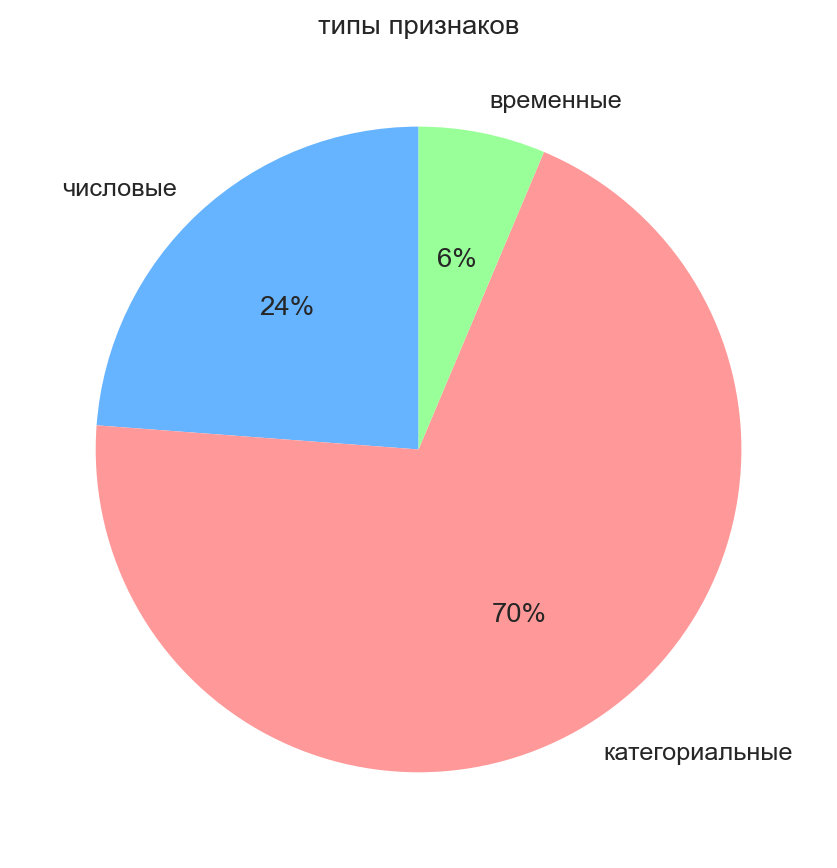
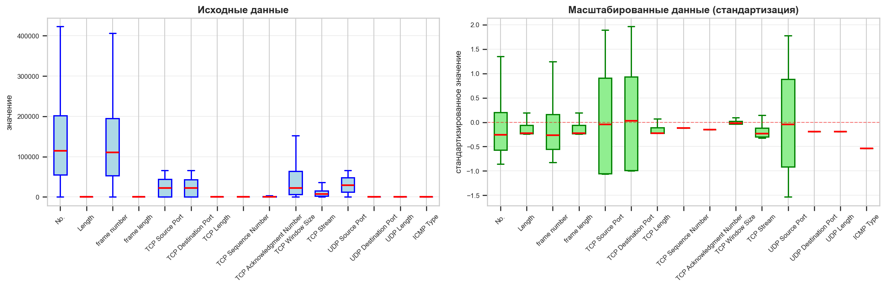
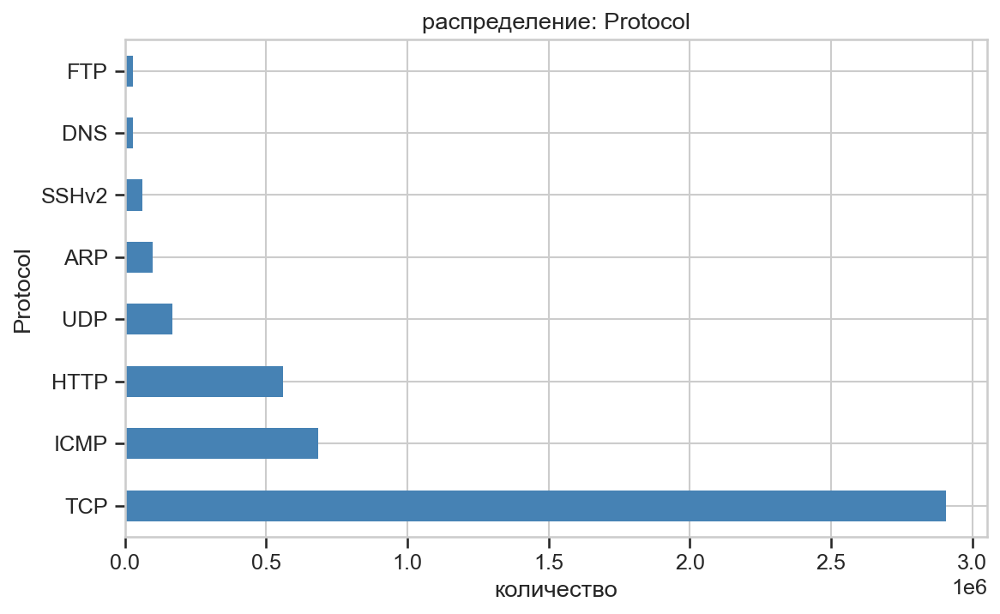

## 1. Общая характеристика признаков

### Типы признаков в датасете
- **Числовые признаки**: 15 (23.8%) : 15
- **Категориальные признаки**: 44 (69.8%) : 44
- **Временные признаки**: 4 (6.3%) : 4
- **Всего признаков**: 63
- **Записей в датасете**: 4,543,916

## 2. Статистика числовых признаков

### Средние значения и стандартные отклонения
| Признак | Среднее значение | Стандартное отклонение |
|---------|-----------------|----------------------|
| No. | 163,902.65 | 191,390.08 |
| Length | 659.38 | 2,575.27 |
| frame number | 162,067.82 | 197,037.42 |
| frame length | 659.38 | 2,575.27 |
| TCP Source Port | 23,521.31 | 22,170.30 |
| TCP Destination Port | 22,015.55 | 22,160.45 |
| TCP Length | 661.18 | 2,896.50 |
| TCP Sequence Number | 1,867,240.97 | 16,218,033.17 |
| TCP Acknowledgment Number | 31,572,059.27 | 205,492,398.47 |
| TCP Window Size | 44,567.51 | 1,141,049.67 |
| TCP Stream | 24,440.40 | 76,295.71 |
| UDP Source Port | 30,341.23 | 19,797.95 |
| UDP Destination Port | 1,709.88 | 8,792.73 |
| UDP Length | 15.02 | 36.21 |
| ICMP Type | 0.67 | 1.25 |

## 3. Характеристика категориальных признаков

| Признак | Уникальных значений | Пропуски (%) |
|---------|--------------------|--------------|
| Source | 166,357 | 0.0 |
| Destination | 151,933 | 0.0 |
| Protocol | 135 | 0.0 |
| Info | 3,257,707 | 0.0 |
| Frame Protocols | 222 | 0.0 |
| Ethernet Source | 10 | 0.0 |
| Ethernet Destination | 20 | 0.0 |
| Ethernet Type | 3 | 0.0 |
| IP Source | 318,179 | 2.2 |
| IP Destination | 151,914 | 2.2 |

## 4. Распределение сетевых протоколов

| Протокол | Количество | Процент |
|----------|------------|---------|
| TCP | 2,907,432 | 63.99% |
| ICMP | 685,619 | 15.09% |
| HTTP | 559,500 | 12.31% |
| UDP | 168,194 | 3.70% |
| ARP | 99,318 | 2.19% |
| SSHv2 | 60,994 | 1.34% |
| DNS | 29,626 | 0.65% |
| FTP | 28,598 | 0.63% |

## 5. Детальная статистика числовых признаков

| Признак | Максимум | Q3 | Медиана | Q1 | Минимум |
|---------|----------|------|---------|------|---------|
| No. | 1,273,831 | 202,063 | 114,473 | 54,902 | 1 |
| Length | 65,226 | 501 | 70 | 66 | 42 |
| frame number | 1,273,831 | 194,386 | 110,175 | 52,965 | 1 |
| frame length | 65,226 | 501 | 70 | 66 | 42 |
| TCP Source Port | 65,535 | 43,617 | 22,616 | 80 | 0 |
| TCP Destination Port | 65,535 | 42,755 | 22,616 | 80 | 0 |
| TCP Length | 65,160 | 348 | 0 | 0 | 0 |
| TCP Sequence Number | 4,294,966,849 | 588 | 1 | 1 | 0 |
| TCP Acknowledgment Number | 4,010,385,536 | 1,449 | 178 | 1 | 0 |
| TCP Window Size | 1,073,725,440 | 64,240 | 22,616 | 5,824 | 0 |

## 6. Выводы

1. **Преобладание категориальных признаков** (69.8% от общего числа)
2. **Доминирование TCP трафика** (2,907,432 пакетов) 

### Ключевые метрики датасета:
- **Объем данных**: 4.54 млн записей
- **Количество признаков**: 63
- **Основные протоколы**: TCP (64%), ICMP (15%), HTTP (12%)
- **Диапазон размеров пакетов**: от 42 до 65,226 байт
- **Уникальных IP-адресов источника**: 318,179
- **Уникальных IP-адресов назначения**: 151,914

